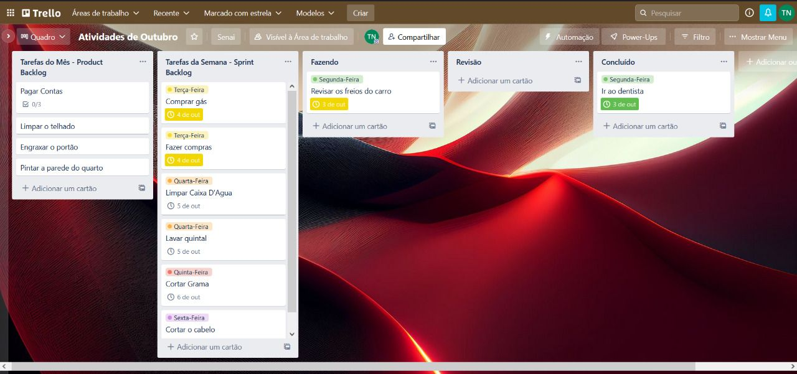
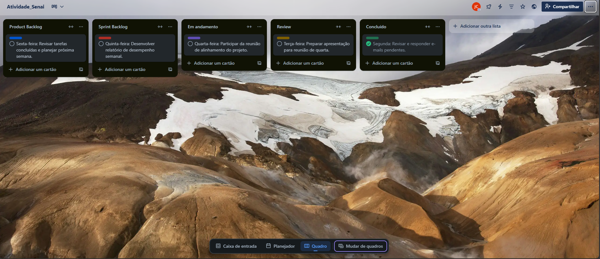

## No decorrer de seus estudos sobre metologias ágeis, você ira desenvolver as seguintes capacidades:

- Reconhecer metodologias ágeis, tendo em vista seu contexto de aplicação.
- Aplicar método Scrum para metodologia ágil no desenvolvimento de projetos de TI.
- Reconhecer a importância de se empenhar em resolver os problemas e atender às necessidades apontadas.

## Para desenvolver tais capacidades, você deverá estudar os seguintes temas:

- Ferramentas disponíveis para aplicação das metodologias ágeis.
- Definição, características e aplicações do método Scrum.
- Técnicas para resolução de problemas.

# Metodologias tradicionais X Ágeis

O quadro a seguir mostra as principais diferenças entre as metodologias tradicionais e ágeis:

| Tradicionais | Ágeis |
:-:|:-:
| Foco na etapa de planejamento | Foco no desenvolvimento
| Processos mais longos de desenvolvimento | Etapas de desenvolvimento mais curtas |
| Uma etapa só começa após o término da anterior | Etapas ocorrem simultaneamente |
| Sem a previsibilidade de eventuais problemas | Contempla possíveis mudanças ao longo do processo |
| Resultado é entregue uma única vez | Entregas parciais ao longo do processo |
| Mais detalhada, rígida e rigorosamente documentada | Menos formais, mais flexível e colaborativa |

### O exemplo a seguir mostra, na prática, como as metodologias ágeis e tradicionais podem trazer benefícios ou até dificuldades para o fluxo de desenvolvimento de um projeto.

***Você está realizando um curso. Devido ao distanciamento social, ocasionado pela pandemia, o professor passou uma lista de itens a serem estudados, de trabalhos e tarefas a serem entregues e estabeleceu uma data para a prova final.***

***Os trabalhos e tarefas serão realizados em duplas. A data de entrega, o professor deixou a critério de vocês, mas a entrega da versão final não deve ultrapassar o final do semestre. A prova final também ocorrerá ao final do semestre.***

***A nota final dependerá da qualidade das tarefas e dos trabalhos, do cumprimento dos prazos de entrega, bem como da nota da prova.***

***Agora, você precisa realizar um planejamento para cumprir todos esses requisitos determinados por seu professor.***

### Veja como seria o projeto para resolução dessa situação, a partir das abordagens tradicionais e ágeis:

| Tradicionais - rígida e inflexível | Ágeis - flexível e colaborativa |
:-:|:-:
| A sequência de tarefas/estudo definida não poderá ser alterada e, portanto, você só pode iniciar uma tarefa após sua dupla terminar a anterior, e vice-versa. | As tarefas podem ser realizadas ao mesmo tempo, ou seja, você pode realizar uma tarefa e sua dupla outra. |
| Os trabalhos e tarefas serão entregues apenas quando estiverem totalmente concluídos, ao final do semestre. Portanto, vocês não terão o feedback do professor para corrigi-los e melhorar sua nota. Isso também pode impactar na prova final, pois o seu entendimento sobre o assunto pode estar errado. | Vocês podem entregar as tarefas e os trabalhos ao longo do semestre. Conforme receberem o feedback do professor, podem aprimorar as versões até a entrega final e compreender o assunto com mais assertividade. |
| O cronograma e a sequência das tarefas são inflexíveis, ou seja, qualquer imprevisto, como falta de acesso à internet, por exemplo, pode implicar o atraso da entrega final, deixando você e sua dupla sem essas notas. | Como as entregas serão parciais, imprevistos não impactarão a entrega final, pois você e sua dupla podem reestruturar a sequência de atividades que cada um irá executar. |

***Portanto, analisando o quadro acima, fica evidente por que as metodologias ágeis têm sido cada vez mais aplicadas no desenvolvimento de produtos e serviços. Por serem mais flexíveis do que as tradicionais, apresentam características que permitem a antecipação de problemas, bem como uma maior adaptabilidade de recursos, processos e mudanças.***

# Métodos Ágeis: Scrum, Lean, Kanban e XP...

Há diversos tipos de metodologias ágeis, veja alguns exemplos:

- Scrum
- XP
- Crystal
- Agile Modeling
- ASD Adaptive Software Development
- DSDM Dynamic Solutions Delivery Method
- FDD Feature Driven Development
- Lean Development
- Pragmatic Programming
- OpenUP
- Kanban

***Todas essas metodologias são baseadas na filosofia Agile, porém, cada uma tem características próprias, adequadas para projetos diferentes. A escolha de uma metodologia deve ser cuidadosamente analisada para melhor se adaptar ao projeto e à organização, considerando o tipo de projeto, a duração, o nível de complexidade e as tecnologias utilizadas.***

# A seguir, conheça as principais metodologias ágeis aplicadas ao desenvolvimento de projetos atualmente:

## Kanban

Em um quadro, são dispostas todas as tarefas escritas em cartões e separadas em colunas. Assim, fica mais fácil equilibrar os fluxos de trabalho e visualizar as tarefas a serem realizadas, as que estão em andamento e as já concluídas, além dos respectivos responsáveis.
Geralmente as cores vermelho, amarelo e verde simbolizam a quantidade de estoque ou o status das tarefas, mas cada projeto pode ter sua padronização própria de cores. O importante é que o quadro de tarefas seja visualmente compreendido.

## Scrum

Apresenta a divisão do projeto em diversas fases, chamadas sprints. Em geral, tem as seguintes principais características:

- Ênfase no gerenciamento de projetos.
- Times (equipes) autogerenciáveis.
- Medição diária de progresso.
- Evita seguir passos pré-definidos.
- Demonstração do sistema ao final de cada iteração.

## XP

A metodologia XP (Extreme Programming, ou programação extrema, em português) é geralmente aplicada para o desenvolvimento de software, apresentando as seguintes características:

- Ênfase em práticas de desenvolvimento.
- Ênfase na colaboração.
- Criação de software o mais rapidamente possível.
- Valores: comunicação, feedback, simplicidade e coragem.
- 12 práticas-chave.

## Lean Development

A metodologia ágil Lean Development, ou desenvolvimento enxuto, em português, tem por objetivo mapear desperdícios, seja de tempo e recursos, enxugando ou retirando etapas desnecessárias ao desenvolvimento do projeto. Essa metodologia apresenta as seguintes características:

- Ênfase na redução do desperdício.
- Entregas rápidas de resultados.

# Mais sobre a metodologia Scrum

### Scrum FrameWork

O Scrum framework (ou a estrutura do Scrum) é formado de várias etapas, com nome e objetivos/funções bem delimitados.

Siga a sequência númeria para conhecê-los.

## Sprint 

***Os sprints são os ciclos de entrega, que duram de 2 a 4 semanas. Durante os sprints são desenvolvidos os itens selecionados na sprint planning (reunião de planejamento).***

## Product Backlog

***Product Backlog (carteira de produtos, em português) é a lista de funcionalidades brevemente descritas que o produto ou serviço deve apresentar. O Product Backlog é fracionado e cada parte dele é implementada na respectica entrega (sprint).***

## Sprint Planning 

***Sprint Planning (planejamento) é a reunião na qual são selecionadas funcionalidades do product backlog que serão priorizadas naquele sprint (ciclo). Ocorre sempre no início de cada sprint.***

## Sprint Backlog

***Sprint Backlog é a lista de funcionalidades selecionadas do product backlog durante a sprint planning. Os itens selecionados deverão ser desenvolvidos durante a spint.***

## Scrum Team 

***Scrum Team é a equipe envolvida no projeto e e compromete a desenvolver os itens selecionados durante a sprint.***

## Daily Meeting

***Daily meeting é uma reunião diária de cerca de 15 minutos, com o objetivo de esclarecer o que foi realizado no dia anterior, identificar impedimentos e priorizar o que será feito no dia atual.***

## Sprint Review

***Sprint Review é a reunião realizada ao final de cada sprint (ciclo), na qual são apresentadas as funcionalidades ou resultados alcançados da sprint backlog.***

## Increment

***O Incremento ou mudança de backlog é a soma de todos os itens selecionados no sprint e que foram completados, somados aos valores de todos os incrementos de todos os ciclos anteriores.***

***Esses itens que foram desenvolvidos ainda podem sofrer ajustes antes de serem considerados finalizados, configurando uma mudança de backlog***

## Release 

***Release é a entrega de um ou mais incrementos.***

***O Scrum Framework pode ser dividido entre eventos e artefatos. A sequência de eventos cria uma rotina que grante que todas as ações sejam realizadas.so Os artefatos são artifícios criados para auxiliar na concretização dos eventos. Veja a seguir a classificação das etaps do Scrum:***

# Scrum Team

O Scrum Team é composto pelo Product Owner, Scrum Master e o time ou equipe de desenvolvimento.

## Product Owner (PO)

***O Product Owner(PO) é o dono do projeto, que determina o que e o porque fazer. Essa pessoa define os itens da backlog do produto, ou seja, determina quais atividades ou tarefas serão executadas no sprint. O PO auxilia a equipe a ter uma visão clara sobre o objetivo final do produto, mantendo-se disponível para dúvidas.***

- trazer clareza sobre os itens a serem desenvolvidos
- priorizar os itens do product backlog a serem desenvolvidos no ciclo
- ser transparente quando ao objetivo do projeto ao longo do percurso.

## Scrum Master (SM)

***O Scrum Master é aquele que foca em como trabalhar melhor, exercendo o papel de facilitador do time durante o processo de desenvolvimento do projeto. Ele assume a responsabilidade de comunicação e bloqueador de interferências externas e ajuda a equipe na remoção de impedimentos***

- comunicar o objetivo e os itens do backlog do produto ou serviço
- criar itens de forma clara e concisa
- facilitar os processos scrum 
- remover impedimentos
- facilitar os eventos do Scrum(como as reuniões diárias)

## Team 

***O time é a equipe de desenvolvimento. Os integrantes não seguem as restrições de papéis tradicionais (designer, desenvolvedor, por exemplo) e são multifuncionaias, além de auto-organizáveis (atuam de forma autônoma e cooperativa para decidirem a melhor forma de realizar uma determinada tarefa.)***

***O time faz a autogestão e não deve ser tão pequeno que não consiga realizar uma interação, nem tão grande a ponto de gerar complexidade. É comum encontrar times de 4 a 8 pessoas (SM e PO não estão inclusos nessa contagem).***

***Esse modelo é projetado para ser versátil, flexível, criativo e produtivo, a fim de garantir que as entregas sejam concluídas nos ciclos determinados.***

- Trabalhar cooperativamente e comprometer-se integralmente com as entregas;
- completar os itens selecionados para o ciclo (a responsabilidade de entrega é do time e não de uma única pessoa).

# Atividade 

Uma das ferramentas que forma disseminadas no mercado e que tem sido muito utilizada é o Trello. trata-se de uma ferramenta gratuita que organiza seus projetos em quadros, possibilitando melhor visibilidade sobre o item que está sendo desenvolvido, quem é seu responsável, quais itens estão parados, em andamento, resumidamente, qual é o status de um item.

Você deverá utilizar a ferramenta gratuita Trello para implementar a metodologia Scrum, propondo uma organização semanal de suas atividades, de segunda a sexta-feira, contendo, no mínimo, 5 cards.
 
Na imagem abaixo, segue um exemplo de organização de tarefas: 

## Minha atividade:

